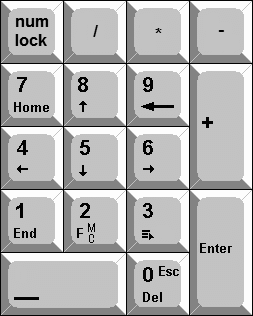

<h1 align="center">AHK-helper</h1>

<a href="https://www.instagram.com/jj_cotes/"><strong>José J. Cotes A.</strong></a> <!--https://github.com/jjCotes/-->

<h3>Starting point</h3>

    When I started to mess with 60% keyboards I figure needed a way to keep using some keys from full-size that where not present in 60% layouts, some times said keyboards don't have a PrtSc key and some other useful stuff. First solutio6to this proble would be using a full-size Keyboard instead but I needed to travel with it, second solution is using QMK to set the needed keys to a macro but the butget keyboard that I got does not support QMK, so the best solution for me was AHK.

    I had some experience using AHK for productivity on big keyboards by simplifying shortcuts, this time the intended thing was the opposite, creating shortcuts for the actuation on a single key. when I got it to work them started to experiment with other productivity problems, those solutions are being displayed in the repository. Main.ahk is the current set in use

<h3>About AutoHotKey</h3>
If you ask something like "Can I write a script on AHK that...?" probably the answer is yes

| Matter        | Description                                       | link                                                                     |
| ------------- | ------------------------------------------------- | ------------------------------------------------------------------------ |
| Why AHK       | Taran Van Hemert's introduction to AHK | <a href="https://youtu.be/Arn8ExQ2Gjg">[link]</a>                        |
| Main page     | AutoHotKey.com                         | <a href="https://www.autohotkey.com">[link]</a>                          |
| Download      | Installer                              | <a href="https://www.autohotkey.com/download/ahk-install.exe">[link]</a> |
| Documentation | Beginner tutorial                      | <a href="https://www.autohotkey.com/docs/v1/Tutorial.htm">[link]</a>     |

Scrips in this repository are intented for AHK v1

**Startup folder:** `Win` + `R` | `shell:startup`

<h2 align="center">MediaNav.ahk</h2>

 
    This code creates shortcuts for some Multimedia Keyfuntions using a convination of the AppsKey and some others

| Shortcut        | Line of Code                            | Action        | Status |
| --------------- | --------------------------------------- | ------------- | ------ |
| `AppsKey` + `,` | `AppsKey & ,:: Send {<}`                | `<`           | ✔      |
| `AppsKey` + `-` | `AppsKey & .:: Send {>}`                | `>`           | ✔      |
| `AppsKey` + `S` | `AppsKey & s:: Send {PrintScreen}`      | `PrtSc`       | ✔      |
| `AppsKey` + `B` | `AppsKey & b:: Send {Volume_Up}`        | `Volume_Up`   | ✔      |
| `AppsKey` + `V` | `AppsKey & v:: Send {Volume_Down}`      | `Volume_Down` | ✔      |
| `AppsKey` + `-` | `AppsKey & -:: Send {Media_Play_Pause}` | `Play_Pause`  | ✔      |

<h2 align="center">Numpad+.ahk</h2>

 
    This code creates shortcuts for better navigation using the Numpad on a full-size keyboard 

    

 

<h2 align="center">Character_Helper.ahk</h2>

 
    This code creates a shortcut for every greek letter and some useful mathematical simbols. For greek letter the shortcut cosinste in writing a dot next the name of the letter [ .alpha ] and a coma for capital letters [ ,alpha ]. for mathematical simbols some of the shortcuts are a dot followed by the name [ .naturalnumbers ] and in some cases a dot followed by a convination con simbols [ .!= ]

    <a href="https://youtu.be/jXgzQpJc14M">[Original idea]</a>

<h3>Greek letters</h3>

| Shortcut      | Line of Code           | Character | Status |
| ------------- | ---------------------- | --------- | ------ |
| .alpha        | `::.alpha::{U+03B1}`   | ɑ         | ✔      |
| .beta         | `::.beta::{U+03B2}`    | β         | ✔      |
| .gamma        | `::.gamma::{U+03B3}`   | γ         | ✔      |
| .delta        | `::.delta::{U+03B4}`   | δ         | ✔      |
| .epsilon      | `::.epsilon::{U+03B5}` | ε         | ✔      |
| .zeta         | `::.zeta::{U+03B6}`    | ζ         | ✔      |
| .eta          | `::.eta::{U+03B7}`     | η         | ✔      |
| .theta        | `::.theta::{U+03B8}`   | θ         | ✔      |
| .iota         | `::.iota::{U+03B9}`    | ι         | ✔      |
| .kappa        | `::.kappa::{U+03BA}`   | κ         | ✔      |
| .lambda       | `::.lambda::{U+03BB}`  | λ         | ✔      |
| .mu           | `::.mu::{U+03BC}`      | μ         | ✔      |
| .nu           | `::.nu::{U+03BD}`      | ν         | ✔      |
| .xi           | `::.xi::{U+03BE}`      | ξ         | ✔      |
| .omikron      | `::.omikron::{U+03BF}` | ο         | ✔      |
| .pi           | `::.pi::{U+03C0}`      | π         | ✔      |
| .rho          | `::.rho::{U+03C1}`     | ρ         | ✔      |
| .sigma        | `::.sigma::{U+03C3}`   | σ         | ✔      |
| .tau          | `::.tau::{U+03C4}`     | τ         | ✔      |
| .upsilon      | `::.upsilon::{U+03C5}` | υ         | ✔      |
| .phi          | `::.phi::{U+03C6}`     | φ         | ✔      |
| .chi          | `::.chi::{U+03C7}`     | χ         | ✔      |
| .psi          | `::.psi::{U+03C8}`     | ψ         | ✔      |
| .omega        | `::.omega::{U+03C9}`   | ω         | ✔      |
| .stigma       | `::.stigma::{U+03DB}`  | ϛ         | ❌     |
| .digamma      | `::.digamma::{U+03DD}` | ϝ         | ❌     |
| .koppa        | `::.koppa::{U+03DF}`   | ϟ         | ❌     |
| .sampi        | `::.sampi::{U+03E1}`   | ϡ         | ❌     |
| .sho          | `::.sho::{U+03F8}`     | ϸ         | ❌     |
| .san          | `::.san::{U+03FB}`     | ϻ         | ❌     |

<h3>Greek Capital letters</h3>

| Shortcut      | Line of Code           | Character | Status |
| ------------- | ---------------------- | --------- | ------ |
| ,alpha        | `::,alpha::{U+0391}`   | Α         | ✔      |
| ,beta         | `::,beta::{U+0392}`    | β         | ✔      |
| ,gamma        | `::,gamma::{U+0393}`   | Γ         | ✔      |
| ,delta        | `::,delta::{U+0394}`   | Δ         | ✔      |
| ,epsilon      | `::,epsilon::{U+0395}` | Ε         | ✔      |
| ,zeta         | `::,zeta::{U+0396}`    | Ζ         | ✔      |
| ,eta          | `::,eta::{U+0397}`     | Η         | ✔      |
| ,theta        | `::,theta::{U+0398}`   | Θ         | ✔      |
| ,iota         | `::,iota::{U+0399}`    | Ι         | ✔      |
| ,kappa        | `::,kappa::{U+039A}`   | Κ         | ✔      |
| ,lambda       | `::,lambda::{U+039B}`  | Λ         | ✔      |
| ,mu           | `::,mu::{U+039C}`      | Μ         | ✔      |
| ,nu           | `::,nu::{U+039D}`      | Ν         | ✔      |
| ,xi           | `::,xi::{U+039E}`      | Ξ         | ✔      |
| ,omikron      | `::,omikron::{U+039F}` | Ο         | ✔      |
| ,pi           | `::,pi::{U+03A0}`      | Π         | ✔      |
| ,rho          | `::,rho::{U+03A1}`     | Ρ         | ✔      |
| ,sigma        | `::,sigma::{U+03A3}`   | Σ         | ✔      |
| ,tau          | `::,tau::{U+03A4}`     | Τ         | ✔      |
| ,upsilon      | `::,upsilon::{U+03A5}` | Υ         | ✔      |
| ,phi          | `::,phi::{U+03A6}`     | Φ         | ✔      |
| ,chi          | `::,chi::{U+03A7}`     | Χ         | ✔      |
| ,psi          | `::,psi::{U+03A8}`     | Ψ         | ✔      |
| ,omega        | `::,omega::{U+03A9}`   | Ω         | ✔      |
| ,stigma       | `::,stigma::{U+03BB}`  | ϛ         | ❌     |
| ,digamma      | `::,digamma::{U+03BD}` | ϝ         | ❌     |
| ,koppa        | `::,koppa::{U+03BF}`   | ϟ         | ❌     |
| ,sampi        | `::,sampi::{U+03C1}`   | ϡ         | ❌     |
| ,sho          | `::,sho::{U+03D8}`     | ϸ         | ❌     |
| ,san          | `::,san::{U+03DB}`     | ϻ         | ❌     |

<h3>Greek Capital letters</h3>

| Shortcut         | Line of Code                   | Character | Status |
| ---------------- | ------------------------------ | --------- | ------ |
| .infinity        | `::.infinity::{U+221E}`        | ∞         | ✔      |
| .average         | `::.average::{U+00D8}`         | Ø         | ✔      |
| .rationalnumbers | `::.rationalnumbers::{U+211D}` | ℝ         | ✔      |
| .naturalnumbers  | `::.naturalnumbers::{U+2115}`  | ℕ         | ✔      |
| .definitionset   | `::.definitionset::{U+2145}`   | ⅅ         | ✔      |
| .element         | `::.element::{U+2208}`         | ∈         | ✔      |
| .partof          | `::.partof::{U+2286}`          | ⊆         | ✔      |
| .ringoperator    | `::.ringoperator::{U+2218}`    | ∘         | ✔      |
| ,squareroot      | `::.squareroot::{U+221A}`      | √         | ✔      |
| .forbidden       | `::.forbidden::{U+21AF}`       | ↯         | ✔      |
| .!=              | `::.!=::{U+2260}`              | ≠         | ✔      |
| .<=              | `::.<=::{U+2264}`              | ≤         | ✔      |
| .>=              | `::.>=::{U+2265}`              | ≥         | ✔      |
| .~=              | `::.~=::{U+2248}`              | ≈         | ✔      |
| .^=              | `::.^=::{U+2213}`              | ≙         | ❔     |
| .?=              | `::.?=::{U+225F}`              | ≟         | ✔      |
| .+-              | `::.+-::{U+00B1}`              | ±         | ✔      |

<h2 align="center">ES_Support-to_EN.ahk</h2>

 
    This code creates shortcuts for some especial characters for Spanish and French get the keyboard language is set to English, on Spanish the short cut work with `Alt` + `C` or `N` for `Ç` and `Ñ` respectively, on French the shortcut consist of writting dot or coma followed by a vowel and an exponetial [ .a^ ]

<h3>Spanish charaters</h3>

| Shortcut              | Line of Code                   | Character | Status |
| --------------------- | ------------------------------ | --------- | ------ |
| `Alt` + `c`           | `!c:: Send {U+00E7}`           | ç         | ✔      |
| `Alt` + `Shift` + `c` | `!+c:: Send {U+00C7}`          | Ç         | ✔      |
| `Alt` + `n`           | `!n:: Send {U+00F1}`           | ñ         | ✔      |
| `Alt` + `Shift` + `n` | `!+n:: Send {U+00D1}`          | Ñ         | ✔      |

<h3>French charaters</h3>

| Shortcut | Line of Code                   | Character | Status |
| -------- | ------------------------------ | --------- | ------ |
| .a^      | `::.a^::{U+00E2}`              | â         | ✔      |
| ,a^      | `::,a^::{U+00C2}`              | Â         | ✔      |
| .e^      | `::.e^::{U+00EA}`              | ê         | ✔      |
| ,e^      | `::,e^::{U+00CA}`              | Ê         | ✔      |
| .i^      | `::.i^::{U+00EE}`              | î         | ✔      |
| ,i^      | `::,i^::{U+00CE}`              | Î         | ✔      |
| .o^      | `::.o^::{U+00F4}`              | ô         | ✔      |
| ,o^      | `::,o^::{U+00D4}`              | Ô         | ✔      |
| .u^      | `::.u^::{U+00FB}`              | û         | ✔      |
| ,u^      | `::,u^::{U+00DB}`              | Û         | ✔      |

<h2 align="center">Macro helpers outside of AHK</h2>

<a href="https://learn.microsoft.com/en-us/windows/powertoys/"><strong>Power Toys</strong></a>   <a href="https://apps.microsoft.com/store/detail/microsoft-powertoys/XP89DCGQ3K6VLD">[Store page]</a>
 

<a href="https://stefansundin.github.io/altdrag/"><strong>Alt+Drag</strong></a>

